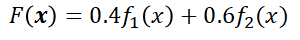
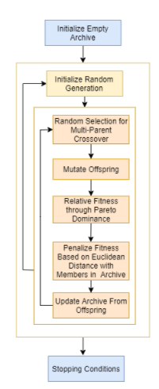
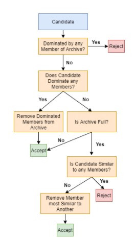

# GeneticAlgorithms

--------
This submodule contains the Genetic Algorithms for solving general optimization problems. There are three main types of
optimization problems: constrained, unconstrained, and multi-objective. As of current, there exists two classes for solving
unconstrained problems, one class for constrained problems, and one class for finding the 
pareto-front of a multi-objective problem. 

## Unconstrained

--------
For unconstrained problems, there exists two classes: `GenericUnconstrainedProblem` and `HyperParamUnconstraiendProblem`.

In contrast to `HyperParamUnconstraiendProblem`, `GenericUnconstrainedProblem` has no hyper parameters necessary for
tuning the algorithm. Instead, `GenericUnconstrainedProblem` only takes in one hyper parameter, the algorithm type.
The algorithms currently available include `greedy`, `differential`, and `self-adaptive`. The `greedy` algorithm produces 
8 possible offspring per set of parents with different hyper-parameters and selects the best for survival. 
The `differential` algorithm uses directional information as its method for mutation. Lastly, `self-adaptation`, unlike 
the other algorithms previously mentioned, does not perform crossover between a set of parents, instead favoring an advanced
log-normal self-adaptive mutation operator performed on a given parent. 

In terms of fitness function evaluations, the `greedy` algorithm calls the fitness function `8*n*m` times, where `n` is 
size of the generation and `m` is the number generations. The `differential` algorithm calls the fitness only `2*n*m` times 
as it only creates two possible offspring. Lastly, the `self-adaptive` algorithm calls the fitness function `4*n*m` times 
as it creates four offspring per individual. 

## Constrained

--------
For constrained problems, there exists only one class: `ConstrainedProblem`. The algorithm works by utilizing 
relative fitness instead of raw fitness. Relative fitness is computed by examining how many times the current individual's 
raw fitness is better than a random selection of individuals from the population. The main problem concerning constrained 
problems is dealing with solutions that break the constraints. To deal with this, the algorithm works by splitting the solutions 
into two groups: those that violate the constraints, and those that do not. When computing relative fitness, if two solutions
are compared that do not break constraints, the solution with the better raw fitness is chosen. If two solutions are chosen 
where one breaks a constraint and the other does not, the solution that does not break any of the constraints is chosen. Lastly,
if two solutions are chosen where they both break the constraints, the solution whose constraints are broken 'less' is chosen.

Because crossing over a set of parents in a constrained environment can lead to offspring breaking constraints that neither 
of the parents break, the `ConstrainedProblem` utilizes the `self-adaptive` algorithm by only mutating the individuals. 

## Multi-Objective

--------
For multi-objective problems, there are two ways to handle them: aggregate summation and pareto-front. 
### Weighted Aggregation
Aggregate summation
works by simply adding the weighted function values from the multiple optimization problems together to form an aggregate function
that is then minimized or maximized. The weights associated with each function value control how influential the corresponding
optimization function is compared to the entirety. 

For example, suppose one wants to minimize two functions simultaneously, F1 and F2, where F2 is slightly more important 
than F1. One can form the aggregate summation as follows:

Once this aggregate function is created, any of the previously detailed algorithms can be used to find the minimum or maximum.

### Pareto-Front
On the other hand, the other way to handle multi-objective problems is through finding the pareto-front, a set of decision 
vectors that contains an archive of solutions such that none of them strongly dominate each other, but only weakly dominate
each other. The `ParetoFrontMOP` class implements this functionality. The algorithm works by creating multiple populations, 
where the offspring are checked to see if they dominate the parents; if so, they are compared to the archive, and the archive
is updated accordingly. 

Here is the general algorithm for creating and comparing the populations:

For updating the Pareto-Archive, here is the algorithm used:

 