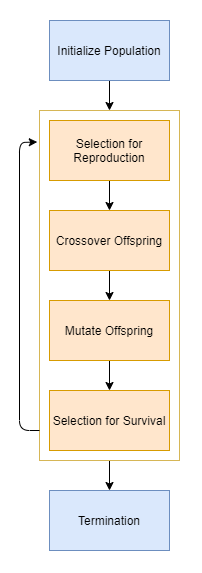

# EvolutionaryComputation

--------------------------------
EvolutionaryComputation is a Python module containing advanced algorithms in the realm of Evolutionary Computation.
Evolutionary Computation is a domain of Computational Intelligence, a sub-field Artificial Intelligence,
where the goal is to model biological evolution in terms as an optimization process. See the section,
`Quick Overview of Evolutionary Algorithms` below for information. 

# Installation

--------------------------------
# Dependencies

--------------------------------
# Algorithms Included

--------------------------------
# Quick Overview of Evolutionary Algorithms

--------------------------------
## Introduction

Evolution can be described as a process by which individuals become ‘fitter’ in different environments through 
adaptation, natural selection, and selective breeding. In evolutionary computation, the goal is to try 
to model these principles to find the best solution to a problem. Each possible solution to a problem is represented as 
an individual in a pool of a population, where one performs adaptation, natural selection, and selective breeding on 
those possible solutions to find the best solution for the problem.

### Optimization Problems

Evolutionary Computation is commonly used to solve/find the minima or maxima of optimization problems. There are three
main types of optimization problems: unconstrained, constrained, and multi-objective. Unconstrained problems can be as 
simple as minimizing the error rate of a function given some weights or parameters, while constrained problems might involve
minimizing the cost of a pressure vessel through optimizing the dimensions of the vessel while meeting some safety and 
physics criterion. Lastly, multi-objective problems are situations where the goal is to solve multiple constrained or unconstrained
optimization problems simultaneously. The inspiration for using Evolutionary Computation in finding these extrema points
is that Evolutionary Algorithms are guided random search techniques that do not require knowledge of the derivative of the function,
which is the main component of classical numerical methods. 

### Diagram Overview

Here is a basic flow diagram of an evolutionary algorithm:

The algorithm can be broken down into six main components Initial Population, Selection for Reproduction, Crossover, Mutation,
Selection for Survival, and Termination:

### Initial Population

The goal of the initial population is to present the algorithm with a range of diverse solutions. Initial populations where 
each solution is similar will only lead to a local search while initial populations with very distinct solutions will lead 
to a global search. The tradeoff between the two is that a local search will converge much quicker than a global search. 

### Selection for Reproduction

The purpose of selecting individuals for reproduction is to model natural selection in how only the fittest individuals 
are allowed to mate. There are many different ways for selecting individuals for reproduction, but all have a tradeoff 
between exploration and exploitation. Exploration refers to how well the algorithm explores the domain space, while exploitation
refers to how well the algorithm will converge. If the selection criterion for reproduction is random then good solutions 
might mate with bad solutions and create worse solutions; however, if the selection criterion for reproduction is to only 
take the best, then that is equivalent to a local search. After the set of parents have been selected for reproduction, 
the offspring is created through two main mechanisms: crossover and mutation. 

### Crossover Techniques

The goal of crossover is to combine the informational material of the parents. There are two main types of crossover operators,
averaging and 'intuitive' crossover. Averaging simply takes the average of the variable values of the parents, while 'intuitive'
crossover swaps the variable values of the parents. One of the main problems of crossover is known as the 'permutation' problem,
where two independent solutions can have extremely different variable values but yield similar results, thus averaing or swapping
their variable values can yield poor offspring; however, this normally only occurs when designing extremely complex systems, 
such as neural network architectures.  

### Mutation Techniques

The goal of mutation is to introduce new informational material into the offspring. After the offspring has been crossed 
over, new information can be inserted by simply adding small perturbations to the variables values of the offspring. Another 
problem with crossover is that it only works with the informational material of the parents, which are based off the informational
material of the initial population. In this way, for the algorithm to explore new regions it needs new variable values that
were not present in the parents. This is achieved through mutation by simply adding small random values to the offspring. 

### Selection for Survival

Once the offspring is created it is time to decide who survives and who does not. Do the offspring always replace the parents?
Are multiple offspring created per set of parents, and the best set wins? Or are all the parents and offspring pooled together, and
the best half are selected for survival? As stated in the Selection for Reproduction section, selection for survival is 
directly influential on the exploration and exploitation of the algorithm. If random selection is used for survival then 
the algorithm has great exploration as it does not converge to any particular solution, but since the selection is random 
then there is a chance that the best solution can be lost. However, on the other hand, if only the best solutions are kept
for survival then the algorithm shows great exploitation as it will never lose the best solutions, but it will show poor 
exploration as the algorithm will be equivalent to performing a local search about the top solutions. 

### Termination

The algorithm repeats the process of selection for reproduction, crossover, mutation, and selection for survival until termination.
The most common termination criterion is simply exiting once the number of generations has reached a user defined limit. 

## Further Resources

--------------------------------
Evolutionary Computation is a very broad and dense subject that can take up an entire semester at the senior or graduate 
level in a Computer Science program. The brief overview given only details the subject matter necessary to understand the 
basics of Evolutionary Computation. If you are wanting to learn more about the subject, I, the author, have written extensively
over the subject by providing a full course on Towards Data Science.  

Here is the main page containing all the links to the articles:

https://towardsdatascience.com/evolutionary-computation-full-course-overview-f4e421e945d9
